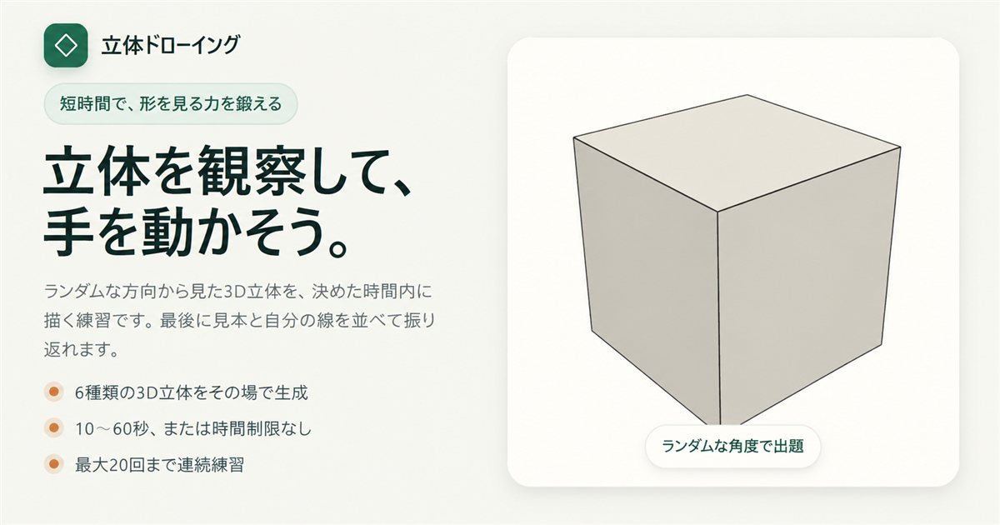

# 立体ドローイング

3Dで生成された立体を観察し、制限時間内に描くためのWebアプリケーションです。  
短時間の反復練習から、描画後の比較・振り返りまでをブラウザ上で完結できます。

[公開デモを試す](https://rikuru-sys.github.io/SolidDrawing/)



## このアプリについて

立体を描く練習では、毎回異なる見本を用意する手間や、描いた結果を客観的に振り返りにくいという課題があります。

このアプリでは、立体・向き・比率・光源をその場で生成し、見本の観察、描画、比較、保存、同じ条件での再練習までを一つの流れとして提供します。

## 主な機能

- 立方体、直方体、円柱、楕円柱、三角錐、円錐の3D見本を生成
- 10〜60秒または時間制限なし、最大20回までの連続練習
- 簡単・難しいの2段階で立体の向きを調整
- 輪郭線と薄い陰影、輪郭線と影、見えない部分を点線で示す表示に対応
- 見本と描画スペースの上下・左右配置を変更
- 見本を途中で隠すモード、見本だけを表示するモード
- ペン、点線、補助線、影ペン、消しゴムと、太さ・色・透明度・手振れ補正の設定
- 元に戻す、やり直す、全消去に対応
- 描画後に見本との横並び比較・中心を合わせた重ね合わせ比較を表示
- 輪郭、線の傾き、大きさ、比率と、影表示時の投影影を使った自動評価
- 見本、描画、比較画像、全結果をPNG形式で保存
- 気になる見本をお気に入りに保存し、同じ条件で再練習
- 設定とお気に入りをブラウザ内に保存
- 固定シードを指定し、同じ条件の見本を再現

## 技術的なポイント

### 再現可能な3D見本生成

Three.jsで立体を描画し、形状、比率、カメラ、物体の回転、光源をプロンプトデータとして管理しています。乱数生成をシード値から分離しているため、通常はランダムに出題しながら、テストや再練習では同じ見本を再現できます。

### 拡張しやすい描画ツール

描画ツールごとに線の太さ、透明度、破線、評価時の扱いを定義し、ツールレジストリから利用する構成にしています。影ペンは通常線とは別の評価役割を持つため、透明度に頼らず投影影を識別できます。新しいペンを追加するときに、描画処理全体へ変更が広がりにくい設計です。

### CanvasとSVGの使い分け

練習中の入力にはCanvasを使用し、結果画面と画像出力にはストロークデータから生成したSVGも利用しています。画面サイズが変わっても線を滑らかに表示でき、見本との比較や保存にも同じ描画データを再利用できます。

### 画面と処理の責務分離

`app/page.tsx`は画面遷移と機能間の接続に絞り、練習セッション、試行結果生成、結果画面内の比較状態、LocalStorageの読み書きを機能別に分離しています。各処理の利用範囲を狭くすることで、変更箇所を追いやすく、ブラウザ機能を差し替えたテストを書きやすい構成にしています。

### 位置に左右されにくい形状・影評価

見本と描画の中心を合わせてから、輪郭、線の傾き、大きさ、縦横比を評価します。「輪郭線と影」では、同じ中心合わせを影にも適用し、立体に対する影の方向・位置・広がりを別項目で評価します。描いた位置そのものではなく、形・大きさ・相対的な位置関係を振り返るための補助指標です。

### 画面サイズへの対応

デスクトップ、タブレット、液晶ペンタブレットでの利用を想定し、横長画面や高さの低い画面では、練習に必要な操作を一画面内に収めるレスポンシブ調整を行っています。

## 使用技術

| 分類 | 技術 |
| --- | --- |
| フレームワーク実行環境 | Vinext |
| ビルドツール | Vite |
| UI | React / TypeScript |
| 3D描画 | Three.js |
| テスト | Vitest |
| 静的解析 | ESLint / TypeScript |
| 公開 | GitHub Pages / GitHub Actions |
| データ保存 | LocalStorage |

## ディレクトリ構成

```text
app/
├─ page.tsx                 # 画面遷移とアプリ全体の連携
└─ styles/                  # 画面・機能単位のスタイル

src/
├─ domain/
│  ├─ prompt/               # 出題データと見本生成条件
│  └─ random/               # シード付き乱数
├─ features/
│  ├─ drawing/              # 描画処理、ペン、SVG出力
│  ├─ evaluation/           # 自動形状・影評価
│  ├─ favorites/            # お気に入り管理
│  ├─ home/                 # トップ画面
│  ├─ practice/             # 練習セッションとタイマー
│  ├─ results/              # 試行結果生成、比較、評価、画像保存
│  ├─ sample/               # Three.jsによる3D見本描画
│  └─ settings/             # 設定画面と設定保存
└─ shared/                  # 共通のブラウザストレージ処理
```

## 設計資料

- [アーキテクチャ](./docs/ARCHITECTURE.md)：全体構成、データの流れ、拡張ポイント
- [技術的意思決定](./docs/DECISIONS.md)：採用した設計と理由、トレードオフ
- [自動評価](./docs/EVALUATION.md)：形状・影の評価項目、計算方法、判定基準
- [テスト方針](./docs/TESTING.md)：テスト対象、実行方法、手動確認項目

## ローカルでの実行方法

Node.js 22.13以上が必要です。

```bash
git clone https://github.com/rikuru-sys/SolidDrawing.git
cd SolidDrawing
npm ci
npm run dev
```

表示されたローカルURLをブラウザで開いてください。

## 検証

```bash
# ユニットテスト
npm test

# 型チェック
npm run typecheck

# 静的解析
npm run lint

# GitHub Pages用ビルド
npm run build:pages
```

乱数、出題生成、設定保存、タイマー、描画履歴、SVG生成、自動評価、お気に入り、各画面の表示ロジックなどをテストしています。

## データの取り扱い

設定とお気に入りは利用端末のLocalStorageに保存します。個人情報の入力や外部サーバーへの送信を必要としない、静的なWebアプリケーションです。

## 今後の改善候補

- 評価結果の分かりやすさと精度の改善
- 練習履歴と立体別統計の追加
- 直線・円などの描画補助ツール
- E2Eテストと複数端末での表示検証の拡充

## 開発状況

現在も機能追加と操作性の改善を継続しています。READMEの内容は、実装の更新に合わせて随時見直します。
