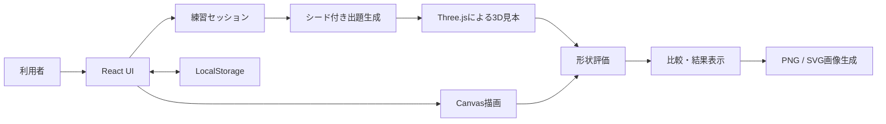
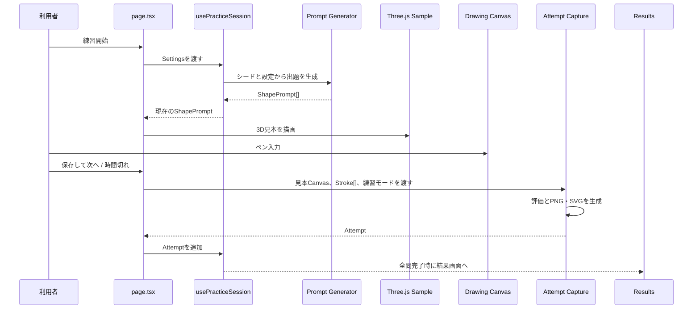
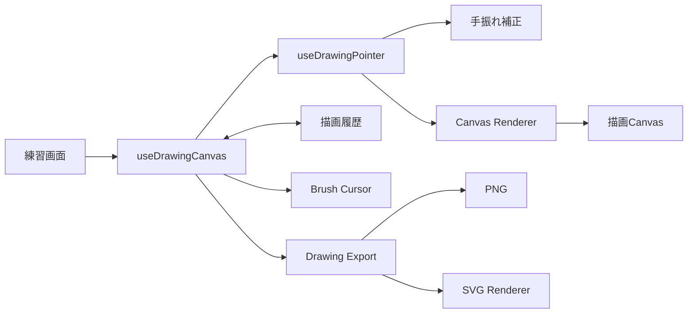
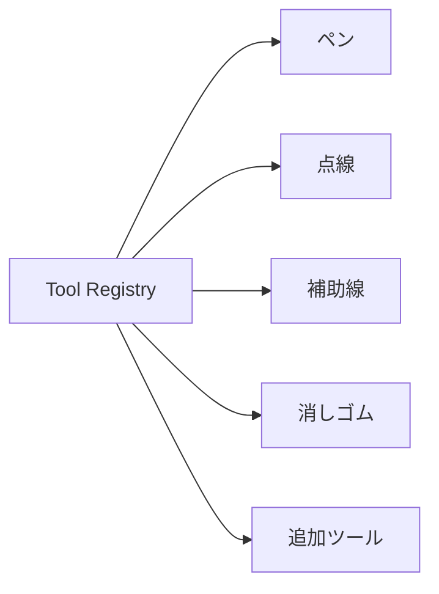

# アーキテクチャ

このドキュメントでは、「立体ドローイング」の構成、主要なデータの流れ、設計上の判断、拡張ポイントを説明します。

## 1. システム概要

立体ドローイングは、ブラウザ上で動作する静的なReactアプリケーションです。バックエンドやデータベースを持たず、3D見本の生成、描画、評価、画像出力を利用端末内で処理します。



主な特徴は次のとおりです。

- 同じシード値から同じ出題を再現できる
- 3D見本、描画、評価を独立した機能として扱う
- 描画中はCanvasを使い、結果表示にはPNGとSVGを使い分ける
- 設定とお気に入りだけをLocalStorageに保存する
- GitHub Pagesで配信できる静的構成にする

## 2. 設計方針

### 関心ごとを機能単位に分離する

画面表示、出題生成、タイマー、描画、評価、保存を個別のモジュールに分けています。UIコンポーネントから計算処理を切り離し、各機能を単体でテストしやすくすることを重視しています。

### 再現可能性を確保する

ランダムな見本生成を直接`Math.random()`へ依存させず、シード付き乱数を利用します。これにより、不具合の再現、固定条件でのテスト、お気に入りからの再練習が可能になります。

### ブラウザ内で処理を完結する

画像や描画データを外部サーバーへ送信せず、端末内で描画・評価・保存します。静的ホスティングで公開でき、個人情報の入力を必要としない構成です。

### 段階的に拡張できる構造にする

描画ツール、立体、評価項目を追加するときに、既存機能への変更が広がりすぎないよう、型定義と機能ごとの窓口を用意しています。

## 3. ディレクトリ構成

```text
app/
├─ page.tsx                 # 画面遷移と機能間の連携
├─ layout.tsx               # メタデータと共通レイアウト
├─ globals.css              # スタイルの読み込み口
└─ styles/                  # 画面・機能単位のスタイル

src/
├─ main.tsx                 # GitHub Pages用のReactエントリーポイント
├─ domain/
│  ├─ prompt/               # 出題データと生成ロジック
│  └─ random/               # シード付き乱数
├─ features/
│  ├─ drawing/              # Canvas描画、ツール、履歴、SVG出力
│  ├─ evaluation/           # 見本と描画の形状評価
│  ├─ favorites/            # お気に入り表示と保存
│  ├─ home/                 # トップ画面
│  ├─ practice/             # 練習画面、セッション、タイマー
│  ├─ results/              # 比較、評価表示、画像出力
│  ├─ sample/               # Three.jsによる3D見本
│  └─ settings/             # 設定画面、設定値、保存
└─ shared/
   └─ storage/              # LocalStorageの共通処理
```

### `app/page.tsx`の役割

`app/page.tsx`は、アプリ全体の調整役です。各画面の詳細な表示や計算は機能別モジュールへ委譲し、主に次を担当します。

- 現在の画面の管理
- 端末へ保存する設定とお気に入りの状態管理
- 練習開始・終了時の機能間連携
- 3D見本、描画、試行結果生成の接続
- 画面遷移後のフォーカス制御

練習中の出題、タイマー、試行結果、検証メッセージ、開始・終了操作は`usePracticeSession`が管理します。フックの返り値は`current`、`timer`、`results`、`validation`、`actions`へ分け、呼び出し側で状態と操作の境界を把握しやすくしています。

結果画面でだけ使う選択中の結果、比較表示モード、重ね合わせの不透明度、画像保存処理は`ResultsScreen`が管理します。`app/page.tsx`には、複数画面や複数機能の連携に必要な状態だけを残しています。

コード内では、ローカルな状態や操作のまとまりを短い区切りコメントで示します。JSDocは、外部から利用する関数や、引数・戻り値だけでは意図を判断しにくい処理を中心に使用します。

専用のルーティングライブラリは使用せず、`home`、`settings`、`practice`、`results`、`favorites`の画面状態をReactのstateで切り替えています。

## 4. 主要なデータモデル

### `Settings`

練習条件と描画設定を表します。

- 出題する立体
- 制限時間と出題回数
- 見本と描画スペースの配置
- 見本の表示方法と光源方向
- 難易度と見本を隠す設定
- ペンの太さ、色、透明度、手振れ補正
- ランダムまたは固定シード

設定画面で編集中の値と、練習開始時に確定した値を区別しています。練習中にペン設定を変更した場合は、現在のセッションと次回利用する保存設定の両方へ反映します。

### `ShapePrompt`

1問分の3D見本を再現するためのデータです。

```text
ShapePrompt
├─ shape                    # 立体の種類
├─ widthScale               # 幅の比率
├─ heightScale              # 高さの比率
├─ depthScale               # 奥行きの比率
├─ cameraAzimuth            # カメラの水平角
├─ cameraElevation          # カメラの垂直角
├─ objectRotationX/Y/Z      # 立体自体の回転
├─ lightDirection           # 光源方向
└─ generation
   ├─ seed                  # 使用したシード
   ├─ version               # 生成ロジックのバージョン
   └─ index                 # セッション内の出題番号
```

生成ロジックのバージョンを保持することで、将来生成方法を変更した場合にも、保存済みデータの互換性を判断できるようにしています。

### `Stroke`

描画した一本の線を、ツール、座標、色、太さ、透明度などの情報として保持します。座標はCanvasの実ピクセルではなく正規化した値で記録し、画面サイズ変更やSVG出力でも再利用します。

### `Attempt`

完了した1問分の結果です。

- 出題時の`ShapePrompt`
- 見本画像
- 描画画像
- 通常表示と中心合わせ表示の描画データ
- 描画SVG
- 経過時間
- 自動評価結果
- 練習モード

練習結果は現在のセッション中だけメモリに保持します。設定とお気に入りとは異なり、ページを閉じた後の練習履歴は保存していません。

## 5. 練習の処理フロー



`features/results/attempt-capture.ts`は、見本画像の取得、自動評価、通常表示と中心合わせ表示のPNG・SVG生成をまとめて`Attempt`へ変換します。見本のみ表示モードでは描画画像を生成せず、未評価の結果を設定します。

### 二重終了の防止

制限時間終了とボタン操作が同時に発生しても同じ問題が二重保存されないよう、セッション内に終了処理中の状態を保持しています。

## 6. 出題生成

`domain/random`がシード付き乱数を提供し、`domain/prompt`がその乱数を使って出題を生成します。

同じ条件について、次の値が同じであれば同じ出題列を生成します。

- シード値
- 出題する立体の一覧
- 出題回数
- 光源方向の一覧
- 難易度
- 出題生成ロジックのバージョン

簡単モードでは立体自体の回転を抑え、難しいモードではX・Y・Z方向へ回転させます。カメラ、比率、光源は出題ごとにシード付き乱数から決定します。

## 7. 3D見本の描画

`features/sample`がThree.jsのシーンを構築し、HTML Canvasへ見本を描画します。

主な責務は次のとおりです。

- `ShapePrompt`に対応するジオメトリの生成
- カメラ角度と立体回転の適用
- 表示方式と光源方向の適用
- Canvasサイズ変更時の再描画
- 不要になったThree.jsリソースの破棄

`useSampleCanvas`がReactと描画処理の境界になり、`ResizeObserver`でCanvasのサイズ変更を監視します。トップ、練習、お気に入りの各画面は、同じ見本描画処理を共有します。

## 8. 描画システム

### 入力とストローク

`useDrawingCanvas`は描画履歴と各処理を接続する調整役です。Pointer Eventsの処理やCanvasへの描画などは、責務ごとに次のモジュールへ分けています。

| モジュール | 責務 |
| --- | --- |
| `use-drawing-canvas.ts` | 描画履歴、Canvasのライフサイクル、各処理を接続し、画面へ共通APIを提供する |
| `use-drawing-pointer.ts` | マウス、タッチ、ペン入力からストロークを組み立て、Pointer Captureを管理する |
| `drawing-canvas-renderer.ts` | 座標の正規化、線分の追加描画、Canvas全体の再描画を行う |
| `use-brush-cursor.ts` | ペンと消しゴムのカーソル位置・表示状態を管理する |
| `drawing-export.ts` | CanvasとストロークからPNG・SVGのデータURLを生成する |
| `drawing-history.ts` | ストロークの追加、元に戻す、やり直す、全消去の状態遷移を管理する |



Pointer入力は次の順序で処理します。

1. `pointerdown`で使用中のツールからストロークを作成し、Pointer Captureを開始する
2. `pointermove`で画面座標を0〜1の相対座標へ変換し、手振れ補正後の点をストロークへ追加する
3. 追加された線分だけをCanvasへ描画し、点線では累積線長から破線位置を継続する
4. `pointerup`または入力終了時にPointer Captureを解除し、ストロークを履歴へ追加する
5. 履歴変更やCanvasのサイズ変更時は、相対座標の点列からCanvas全体を再描画する

描画結果だけでなくストロークの配列を保持するため、次の機能を実現できます。

- 元に戻す・やり直す
- Canvasの再描画
- 自動評価用データの生成
- SVGへの変換
- 中心を合わせた比較画像の生成

### ツールレジストリ

ペン、点線、補助線、消しゴムは個別のツール定義として実装し、`tool-registry.ts`へ登録しています。



各ツールは、ストロークの生成、線幅、透明度、破線パターン、評価対象に含めるかどうかを定義します。新しいツールは、ツール定義を追加してレジストリへ登録する形で拡張できます。

### 手振れ補正

入力座標をそのまま描画する処理と、手振れ補正の計算を分離しています。設定された補正強度に応じて点列を平滑化し、確定した座標をストロークとして保存します。

### 画像出力

PNG出力では描画Canvasを白背景の出力用Canvasへ転写します。SVG出力では保存済みのストロークと現在のCanvas表示サイズを`svg-renderer.ts`へ渡します。どちらも中心合わせ用のオフセットを受け取れるため、通常表示と重ね合わせ表示で同じ出力処理を利用できます。

## 9. Canvas・PNG・SVGの使い分け

| 形式 | 用途 | 採用理由 |
| --- | --- | --- |
| Canvas | 練習中の描画と3D見本 | Pointer EventsやThree.jsと組み合わせやすい |
| PNG | 見本、描画、比較結果の保存 | 一般的な画像として扱いやすい |
| SVG | 結果画面の描画表示 | 画面サイズが変わっても線を滑らかに表示できる |

ストロークを元データとして残し、Canvas表示とSVG生成の両方で利用します。結果画面では見本PNGと描画SVGを同じ可変サイズの枠へ配置しています。

## 10. 自動形状評価

評価処理は`features/evaluation`に分離しています。

1. 3D見本Canvasを解析用の小さな画像へ変換する
2. 輝度差から見本の輪郭マスクを生成する
3. 評価対象のストロークから描画マスクを生成する
4. 見本と描画の中心を合わせる
5. 輪郭、傾き、大きさ、比率を計算する
6. 各評価値から総合得点とフィードバックを生成する

位置そのものは得点に含めず、中心を合わせた後も描画を拡大・縮小しません。そのため、描いた場所に左右されにくく、形と大きさを評価できます。

補助線や消しゴムなど、評価へ含めるべきでないツールは、ツール定義の役割に基づいて除外します。

評価は学習を補助するための目安であり、人間による美術的な評価を置き換えるものではありません。アルゴリズムの詳細は、[EVALUATION.md](./EVALUATION.md)を参照してください。

## 11. 状態とデータ保存

### Reactのメモリ上で保持するもの

- 現在の画面
- 現在の練習セッション
- 出題一覧と現在の問題番号
- 描画ストロークと履歴
- 現在の練習結果
- 比較表示の状態

比較表示の状態は`ResultsScreen`、練習セッションの状態は`usePracticeSession`のように、利用する範囲が最も狭い機能で管理します。

### LocalStorageへ保存するもの

- 練習設定
- お気に入りの見本と、その見本を練習したときの設定

保存データを読み込むときは、型や値の範囲を正規化します。古いデータや不正な値があっても、可能な限り既定値へ戻してアプリを継続できるようにしています。

保存処理は次の3層へ分けています。

1. `shared/storage`がJSONの読み書きと、保存済み状態をReactへ接続する`useStoredState`を提供する
2. `features/settings`と`features/favorites`が保存キー、正規化、件数制限など機能固有の規則を持つ
3. `app/page.tsx`が読み書き関数を`useStoredState`へ渡して利用する

この分離により、今後別の端末内保存機能を追加するときも、LocalStorageの例外処理やReactとの同期処理を再利用できます。

## 12. レスポンシブ設計

画面の向きと幅だけでなく、表示領域の高さもレイアウト条件に使用します。特に練習画面では、横長の液晶ペンタブレットで操作ボタンが画面外へ出ないよう、次を調整しています。

- 練習画面にはヘッダーを設けず、見本と描画操作を優先する
- 共通ヘッダーを常設せず、トップ・設定・結果・お気に入りの各画面に必要な導線だけを配置する
- 見本と描画スペースの高さを揃える
- 画面高さに応じてCanvasと比較画像を伸縮する
- 低い画面ではツールバーを複数行に配置する
- タッチ操作を考慮してボタンの操作領域を確保する

スタイルは`tokens.css`、`base.css`、画面別CSS、`responsive.css`に分け、デザイン値とレスポンシブ調整を分離しています。

## 13. ビルドと公開

このリポジトリには2つの実行経路があります。

```text
ローカル開発・通常ビルド
React / Next.js形式のapp
└─ Vinext
   └─ Vite

GitHub Pages
React
└─ Viteによる静的ビルド
   └─ pages-dist
```

- `npm run dev`：Vinextの開発サーバー
- `npm run build`：Vinextによる通常ビルド
- `npm run build:pages`：GitHub Pages向けのViteビルド

GitHub Actionsは`main`ブランチへのpushを契機に`build:pages`を実行し、生成された`pages-dist`をGitHub Pagesへ公開します。

## 14. テスト方針

UIの見た目だけでなく、変更時に壊れやすい計算と状態遷移を中心にテストしています。

- シード付き乱数と出題の再現性
- 設定の正規化と保存
- タイマーと経過時間
- 練習セッションの開始・終了
- 練習モードごとの表示情報と描画キャンバスの要否
- 試行結果の評価とPNG・SVG生成
- 描画履歴とツール登録
- SVG生成
- 形状評価
- お気に入り保存
- 各画面の表示条件
- 保存画像の寸法とファイル名

テスト、型チェック、静的解析、GitHub Pages用ビルドを変更後の基本的な検証としています。

## 15. 主な拡張ポイント

### 新しい立体を追加する

1. `ShapeName`へ種類を追加する
2. 見本用ジオメトリを追加する
3. 設定画面の選択肢へ追加する
4. 出題生成と評価のテストケースを追加する

### 新しい描画ツールを追加する

1. `DrawingToolDefinition`に沿ったツールを作る
2. ツールレジストリへ登録する
3. ツールバーへ選択操作を追加する
4. 描画、SVG、評価時の扱いをテストする

### 新しい評価項目を追加する

1. 評価結果の型へ項目を追加する
2. マスク解析へ計算処理を追加する
3. 評価パネルと保存画像へ表示を追加する
4. 正解例と不正解例を使ったテストを追加する

## 16. 現在の制約

- 練習履歴はページを閉じると失われる
- データは端末ごとに保存され、端末間では同期されない
- 自動評価は2D画像上の輪郭を基準とした補助評価である
- ブラウザや入力機器による描画感覚の差がある
- Vinextはベータ版を利用している
- 現在は静的な単一画面アプリとして構成している

これらは、静的ホスティング、個人情報を扱わないこと、ブラウザだけで練習を完結させることを優先した結果でもあります。
