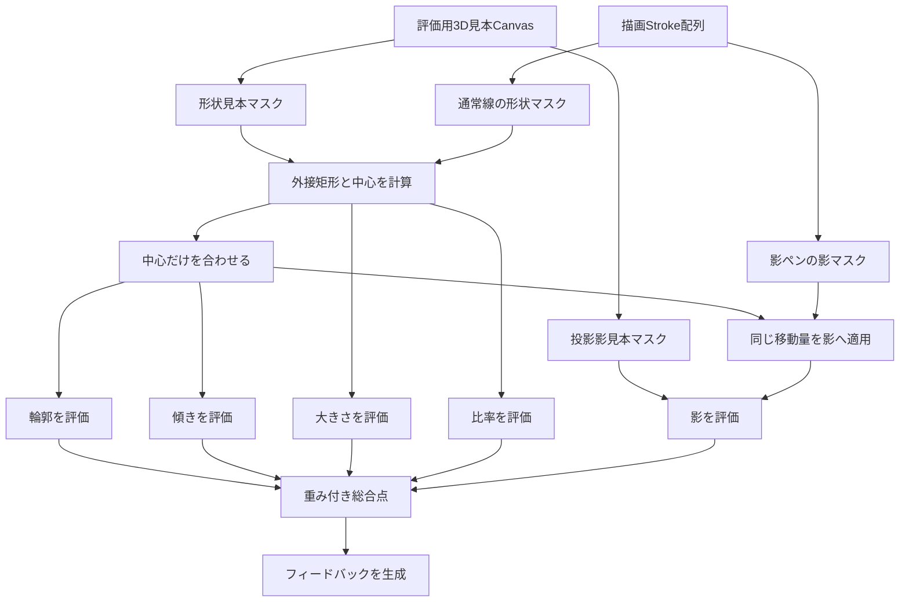

# 自動形状・影評価

このドキュメントでは、「立体ドローイング」の自動形状・影評価について、目的、処理手順、計算方法、判定基準、制約を説明します。

## 1. 評価の目的

自動評価は、描画後の振り返りを補助するための機能です。描いた位置ではなく、見本と同じ形・同じ大きさに描けているかを、次の4項目で評価します。

- 輪郭
- 線の傾き
- 大きさ
- 比率

「輪郭線と影」では、影ペンで描いた投影影についても、立体に対する方向・位置・広がりを5つ目の項目として評価します。

この評価は、美術的な良し悪しや立体理解のすべてを判定するものではありません。利用者が見本と描画の違いに気づくための目安として使用します。

## 2. 評価しないもの

現在の評価では、次の項目を得点へ含めません。

- 描画スペース内の位置
- 線の色
- 線の透明度
- 補助線
- 線の美しさや筆圧
- 立体表面の陰影の塗り方
- 見本の地面線
- 芸術的な表現

位置は見本と描画の中心を合わせるために使用しますが、位置ずれによる減点は行いません。

## 3. 処理の全体像



評価処理は、UIから独立した次の役割に分かれています。

1. `shape-evaluator.ts`：Canvasとストロークを解析用マスクへ変換する
2. `mask-evaluator.ts`：評価可能かを判定し、評価処理全体の順序を管理する
3. `mask-metrics.ts`：中心合わせと、輪郭・傾き・大きさ・比率の得点を計算する
4. `shadow-evaluator.ts`：形状と同じ中心合わせを適用し、投影影を比較する
5. `evaluation-result.ts`：項目別得点から総合点とフィードバックを生成する

マスク比較を独立させることで、Canvas以外の入力方法を追加した場合にも評価計算を再利用できる構成にしています。

## 4. 解析画像への変換

見本と描画は、どちらも`180 × 180`ピクセルの解析領域へ変換します。

```text
ANALYSIS_SIZE = 180
```

画面に表示されているCanvasの解像度や端末のピクセル比にかかわらず、同じ大きさのデータとして比較します。

### 見本マスク

通常は画面に表示している3D見本Canvasを使用します。「輪郭線と影」の場合だけ、同じ立体・向き・カメラ・光源条件から、次の2枚の評価専用Canvasを生成します。

- 形状評価用：立体だけを描き、投影影・地面・地面線を含めない
- 影評価用：投影影だけを描き、立体の色面・輪郭線・地面線を含めない

表示用Canvasは結果画像の保存に使用するため、完成した立体・投影影・地面線を従来どおり残します。評価対象を分けることで、投影影が輪郭・傾き・大きさ・比率へ混ざることを防ぎつつ、影だけを独立して採点できます。

3D見本Canvasを白背景の解析用Canvasへ縮小し、各ピクセルの輝度を次の式で計算します。

```text
輝度 = 赤 × 0.2126 + 緑 × 0.7152 + 青 × 0.0722
```

次のいずれかを満たすピクセルを見本形状の一部として扱います。

- 輝度が`150`未満
- 輝度が`251`未満で、上下左右の隣接ピクセルとの最大輝度差が`9`より大きい

この処理により、濃い線や面と、背景との境界をマスクとして取り出します。

### 長い水平線を除外する安全処理

影モードでは評価専用Canvasへ地面線を描画しません。加えて、形状の見本マスクに意図しない長い水平線が含まれた場合の安全処理として、横一列のうち55％を超えるマスクが存在する行を地面線候補として除外します。

検出した行だけでなく、その上下1ピクセルも除外します。

投影影用の見本マスクでは、横長の影そのものを消さないよう、この安全処理を適用しません。影評価用シーンには最初から地面線を描かないことで分離します。

### 描画マスク

保存されているストロークを解析用Canvasへ描画し、アルファ値が`24`を超えるピクセルを描画マスクとして扱います。

評価時には、表示上の違いが得点へ過度に影響しないよう次のように統一します。

- ペン色を黒にする
- 不透明度を100％にする
- 点線を連続線として描く
- 各ツールの表示線幅を75％にし、最低1.5ピクセルを確保する
- 消しゴムはマスクから線を消す
- 補助線は評価から除外する

ツールごとの扱いは、描画ツール定義の`evaluationRole`で決定します。

| 役割 | 対象ツール | 評価時の扱い |
| --- | --- | --- |
| `draw` | ペン、点線 | 形状マスクへ追加 |
| `shadow` | 影ペン | 影マスクへ追加 |
| `erase` | 消しゴム | 形状・影の各マスクから削除 |
| `ignore` | 補助線 | 評価対象外 |

影ペンは「輪郭線と影」を選択した練習でだけ表示します。色は`#5f615b`、不透明度は`32%`に固定し、選択中のペン幅の4倍で描画します。評価時は黒・不透明のマスクへ変換し、評価用の線幅は表示線幅の75％とします。影かどうかは透明度から推測せず、`shadow`という役割で判定します。

### 小さな描画ゴミの除外

評価マスクを作る前に、孤立した点や極端に短いストロークを除外します。固定の最小値に加え、同じ役割の最も大きなストロークに対する相対値を使います。線の長さと描画範囲の両方が基準以上のストロークだけを評価対象へ残すため、どちらか一方が基準未満の場合は描画ゴミとして除外します。形状線と影線は別々に判定するため、形状線より短い影線も一律には除外しません。

除外後のストロークは、形状評価、影評価、中心合わせ、重ね合わせ表示に使用します。横並びの「描いたもの」には入力した全ストロークを残し、利用者が元の描画を確認できるようにします。消しゴムと補助線はこのフィルターでは削除しません。

「輪郭線と影」の形状評価では、表示用の見本とは別に、投影影と立体表面の陰影を取り除いた輪郭線だけの見本を生成します。輪郭・傾き・大きさ・比率はこの輪郭線と通常ペン・点線ペンを比較し、投影影は影専用の見本と影ペンだけで評価します。

形状評価用と影評価用の見本は、画面に表示している見本Canvasと同じ幅・高さ・縦横比で生成します。評価専用Canvasを正方形へ変形して比較しないため、影モードでも通常モードと同じ投影条件で輪郭と傾きを評価できます。

傾きは、見本線と描画線から局所的な線方向を抽出し、外接矩形内の相対位置ごとに0～180度の方向分布を比較します。描画全体の位置と大きさは正規化するため、平行移動や一様な拡大・縮小では不当に減点せず、形の異なる場所に同じ向きの線を描いた場合は一致とみなしません。描き漏らしによる距離は輪郭項目で評価し、角や交差部のように方向を安定して求められない部分は傾き評価から除外します。

三角錐は、斜めの光による厳密な投影では4頂点の外周が四角形になる場合があります。本アプリでは形を捉える練習として分かりやすくするため、代表となる三角面を専用の影生成面として使い、三角形の投影影を表示・評価します。

通常ペンの色・透明度設定は影ペンへ適用しません。太さと手振れ補正は影ペンでも利用します。

## 5. 評価可能かの判定

見本または描画の外接矩形を取得できない場合は、評価を行いません。

また、描画マスクのピクセル数が`12`未満の場合は、評価できる主線が不足していると判断し、すべての得点を0点にします。

## 6. 中心合わせ

見本と描画の外接矩形から、それぞれの中心座標を求めます。

```text
中心X = (最小X + 最大X) ÷ 2
中心Y = (最小Y + 最大Y) ÷ 2
```

描画マスクを、見本の中心へ合うよう平行移動します。

```text
移動量X = 見本の中心X - 描画の中心X
移動量Y = 見本の中心Y - 描画の中心Y
```

このとき行うのは平行移動だけです。

- 拡大・縮小しない
- 回転しない
- 縦横比を変更しない

そのため、描いた位置は評価へ影響しませんが、大きさや線の傾きの違いは残ります。

中心合わせに使用した移動量は、Canvasサイズに対する割合として`alignmentX`と`alignmentY`へ保存します。結果画面の重ね合わせ表示でも、この値を使用します。

## 7. 許容範囲

手描きの線をピクセル単位で完全一致させることは難しいため、輪郭の比較には`4`ピクセルの許容範囲を設けています。

見本マスクと描画マスクを半径4ピクセル分膨張させ、多少の線ずれがあっても近くに対応する線があれば一致として扱います。

解析領域が180ピクセルなので、許容範囲は一辺のおよそ2.2％です。

## 8. 輪郭の評価

輪郭は、中心合わせ後の描画と見本がどの程度重なっているかで評価します。

### 適合率

描画した線のうち、見本の許容範囲内にある割合です。

```text
適合率 = 見本の近くにある描画ピクセル数 ÷ 描画ピクセル数
```

不要な線を多く描くと適合率が下がります。

### 再現率

見本の線のうち、描画の許容範囲内にある割合です。

```text
再現率 = 描画の近くにある見本ピクセル数 ÷ 見本ピクセル数
```

必要な線が不足すると再現率が下がります。

### 輪郭一致率

適合率と再現率の調和平均を使います。

```text
輪郭一致率 = 2 × 適合率 × 再現率 ÷ (適合率 + 再現率)
```

これにより、線を多く描くだけでも、少なく描くだけでも高得点になりにくくしています。

## 9. 線の傾きの評価

傾き評価では、見本線と描画線の周辺ピクセルから局所的な線の方向を求め、外接矩形内の相対位置ごとに方向分布を比較します。描画全体の位置と大きさは正規化し、描き漏らしによる距離は傾きの減点へ重複して含めず、対応する別の評価項目で判定します。

### 局所方向の計算

対象ピクセルを中心とした半径5ピクセルの範囲からマスク座標を集め、座標の分散と共分散を使って主方向を計算します。

曲線の交差部分や点の集まりなど、方向を安定して求められない場所は評価から除外します。方向の信頼度が`0.18`未満の場合も除外します。

### 方向分布の比較

外接矩形を3×3区画へ分け、各区画の局所方向を0～180度の18区間へ集計します。角度区間の境界付近にある線がわずかな差で別区間になる影響を抑えるため、隣接する角度区間へ値を分配してから平滑化します。

正規化した見本と描画の方向分布を区画ごとに比較し、形の中の同じ位置へ同じ方向の線が同程度含まれているほど高い一致率にします。線の方向は180度反転しても同じ傾きとして扱います。

有効なサンプルが`12`個未満の場合は、安定した傾き評価が難しいため、輪郭一致率を傾き一致率として使用します。

## 10. 大きさの評価

中心合わせ前に取得した外接矩形の幅と高さを比較します。描画を見本の大きさへ拡大・縮小してから比較することはありません。

```text
幅一致率 = 小さい方の幅 ÷ 大きい方の幅
高さ一致率 = 小さい方の高さ ÷ 大きい方の高さ

大きさ一致率 = (幅一致率 + 高さ一致率) ÷ 2
```

見本より大きく描いた場合と小さく描いた場合を、同じ基準で評価します。

## 11. 比率の評価

見本と描画の外接矩形から、幅と高さの比率を求めます。

```text
見本の縦横比 = 見本の幅 ÷ 見本の高さ
描画の縦横比 = 描画の幅 ÷ 描画の高さ

比率一致率 = 小さい方の縦横比 ÷ 大きい方の縦横比
```

同じ大きさでも横長・縦長になっている場合は、比率の得点が下がります。

## 12. 影の評価

「輪郭線と影」では、投影影だけを描いた見本マスクと、影ペンのストロークだけを再描画した影マスクを比較します。影ペンの描画ピクセルが`12`未満の場合は影0点です。

影を評価しない表示方式では、評価結果の`shadow`を`null`にします。「輪郭線と影」で影ペンを使わなかった場合は`shadow`を0点にするため、評価対象外と描き忘れを区別できます。

影だけの中心を見本へ合わせる処理は行いません。先に形状評価で求めた`alignmentX`と`alignmentY`を影マスクにも適用します。これにより、キャンバス内で立体と影をまとめて別の場所へ描いた場合は減点せず、立体に対して影を誤った方向や位置へ描いた場合は差を残します。

中心合わせ後は、輪郭評価と同じく次の両方を調べます。

- 描いた影のうち、見本の影の近くにある割合
- 見本の影のうち、描いた影で再現できている割合

両者の調和平均を影の一致率とします。手描きの塗りむらを考慮し、比較時には`6`ピクセルの許容範囲を設けています。評価するのは投影影の方向・位置・広がりであり、立体表面の陰影や地面線は対象外です。

## 13. 一致率から得点への変換

各項目の一致率は0〜1の範囲へ収め、次の式で0〜100点へ変換します。見た目の差が得点へ反映されるよう、輪郭と傾きは大きさ・比率・影より厳しい指数を使用します。

```text
輪郭得点 = round(一致率 ^ 1.35 × 100)
傾き得点 = round(一致率 ^ 1.4 × 100)
大きさ・比率・影得点 = round(一致率 ^ 1.2 × 100)
```

指数が大きい項目ほど、完全一致から離れたときの減点が大きくなります。

例：

| 一致率 | 単純な百分率 | 輪郭 | 傾き | 大きさ・比率・影 |
| ---: | ---: | ---: | ---: | ---: |
| 1.00 | 100 | 100 | 100 | 100 |
| 0.90 | 90 | 約87 | 約86 | 約88 |
| 0.80 | 80 | 約74 | 約73 | 約77 |
| 0.70 | 70 | 約62 | 約61 | 約65 |
| 0.50 | 50 | 約39 | 約38 | 約44 |

## 14. 総合点

影を評価しない表示方式では、形状4項目の重み付き合計です。

```text
総合点 = round(
  輪郭 × 0.45
  + 傾き × 0.25
  + 大きさ × 0.20
  + 比率 × 0.10
)
```

| 評価項目 | 重み | 評価する内容 |
| --- | ---: | --- |
| 輪郭 | 45％ | 必要な線があり、不要な線が少ないか |
| 傾き | 25％ | 各線の方向が見本と近いか |
| 大きさ | 20％ | 幅と高さが見本と近いか |
| 比率 | 10％ | 全体の縦横比が見本と近いか |

輪郭と線の方向を重視しつつ、同じ大きさで描くという練習目的を得点へ反映しています。

「輪郭線と影」では、上記の形状評価を80%、影評価を20%として計算します。

```text
総合点 = round(
  輪郭 × 0.36
  + 傾き × 0.20
  + 大きさ × 0.16
  + 比率 × 0.08
  + 影 × 0.20
)
```

| 評価項目 | 影表示時の重み |
| --- | ---: |
| 輪郭 | 36％ |
| 傾き | 20％ |
| 大きさ | 16％ |
| 比率 | 8％ |
| 影 | 20％ |

## 15. 結果の表示区分

結果画面では、総合点に応じて表示上の区分を切り替えます。

| 総合点 | 区分 |
| ---: | --- |
| 80点以上 | 高 |
| 60〜79点 | 中 |
| 59点以下 | 低 |

この区分は表示色を切り替えるためのもので、合格・不合格を決めるものではありません。

## 16. フィードバックの決定順

フィードバックは、次の順番で改善点を判定します。最初に該当した内容を表示します。

1. 輪郭が45点未満：角や曲線、輪郭線の方向を確認する
2. 傾きが60点未満：水平線、垂直線、斜線の傾きを確認する
3. 大きさが70点未満：拡大・縮小せず見本と同じ大きさを意識する
4. 比率が70点未満：全体の縦横比を確認する
5. 影を評価する場合に影が60点未満：影の方向・位置・広がりを確認する
6. 総合点が80点未満：重ね合わせでずれた辺を確認する
7. 上記に該当しない：細部と形状・影の位置関係を重ね合わせで確認する

複数項目に改善点がある場合でも、一度に多くの指摘を出さず、優先度の高い一つを表示します。各項目の数値は同時に確認できます。

## 17. 重ね合わせ表示との関係

評価時に計算した`alignmentX`と`alignmentY`を使い、結果画面では見本と描画の中心を合わせて表示します。

重ね合わせでも描画を拡大・縮小しないため、次を目視で確認できます。

- 外側にはみ出した線
- 内側に小さく描いた部分
- 傾きが異なる辺
- 縦横比の違い
- 立体に対する影の方向・位置・広がり

自動得点だけで判断せず、横並び表示と重ね合わせ表示を併用することを想定しています。

## 18. 見本のみ表示モード

外部のペイントソフトで描く「見本のみ表示モード」では、アプリ内に評価対象となるストロークが存在しません。そのため、自動評価は行わず、各得点を0、影得点を評価対象外としてメッセージを表示します。

## 19. テスト

マスク評価は、実際のCanvas表示に依存しない二値マスクを使ってテストしています。

現在の主なテストケースは次のとおりです。

- 同じ形状はすべて100点になる
- 6種類の立体と3種類の描写モード、合計18組み合わせを評価できる
- 影モードでは完成表示・形状だけ・投影影だけの3種類のシーンを生成できる
- 通常ペンと影ペンを、それぞれ形状マスクと影マスクへ分ける
- 形状評価の中心合わせを影にも適用すると、一緒に移動した影は減点されない
- 立体に対する影の相対位置が異なる場合は、影の得点が下がる
- 影ペンの描画が不足している場合は影0点になる
- 位置だけが異なる形状は、中心合わせ後に減点されない
- 大きさが異なる場合は、大きさの得点が下がる
- 縦横比が異なる場合は、比率の得点が下がる
- 大きさと比率が同じでも傾きが異なる場合は、傾きの得点が下がる
- 6種類の各立体で、正しい形、少し崩した形、大きく崩した形の順序を維持する
- 固定した立方体の良い描画は90点以上、普通の描画は60～79点、悪い描画は49点以下になる
- 傾きは位置、大きさ、線幅だけが変わっても不当に下がらない
- 同じ方向の線でも、形の中の位置が異なる場合は傾きの得点が下がる
- 輪郭4ピクセル、影6ピクセルの許容境界を維持する
- 大きさと比率が90％一致する場合の得点を固定する
- 影の位置、方向、長さの差が大きいほど得点が下がる
- 描画ゴミとして除外する固定値と相対値の境界を維持する
- 項目別フィードバックの境界値を維持する
- 総合点が定義した重みから計算される
- 評価できる線が不足している場合は0点になる

テストでは固定データを使用するため、評価ロジックを変更したときに得点の変化を検出できます。

## 20. 現在の制約

### 2D投影画像を比較している

評価対象は3Dモデルそのものではなく、画面へ投影された2Dの見本です。奥行きや立体構造を直接理解して判定しているわけではありません。

### 見本の表示方式に影響される

見本Canvasの輝度からマスクを作るため、薄い陰影、点線、投影影では表示方式によって抽出されるピクセルが変わる可能性があります。影モードでは形状用と影用の評価Canvasを分け、互いの得点へ混ざらないようにしています。

### 影の濃淡は評価しない

影ペンの表示色と透明度は固定していますが、評価時には不透明な二値マスクへ変換します。そのため、現時点で評価するのは投影影の方向・位置・広がりであり、影の濃さやグラデーションではありません。

### 曲線や交点の傾きは安定しにくい

傾きは局所的な線方向から計算するため、円柱や円錐の曲線、線が集中する頂点付近では方向を取得できない場合があります。

### 線の意味は理解しない

輪郭、稜線、補助的に描いた主線などの意味を個別に認識しているわけではありません。評価対象のピクセル同士を比較しています。

### 得点は絶対的な基準ではない

許容範囲や重みは、このアプリの練習目的に合わせた調整値です。画力や立体理解を客観的に証明する指標ではありません。

## 21. 今後の改善候補

- 立体や表示方式ごとの評価閾値の調整
- 輪郭線と内部の稜線を分けた評価
- 曲線と直線を分類した評価
- 頂点や接線など特徴点の比較
- 評価結果のどの部分がずれているかを可視化
- 複数の正解データを使った回帰テスト
- 実際の練習結果を用いた許容範囲と重みの検証

評価ロジックを変更すると過去と同じ描画でも得点が変わる可能性があります。大きな変更を行う場合は、評価方式のバージョンを結果データへ保持することも検討します。
