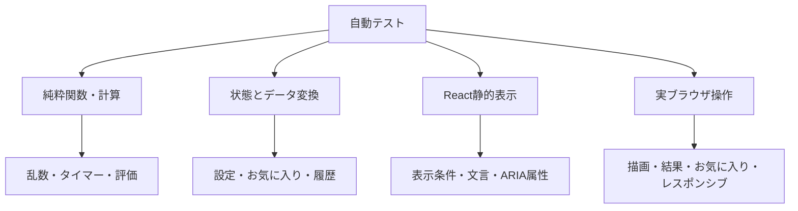
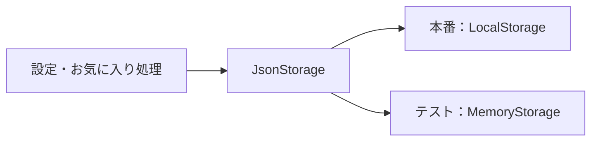

# テスト方針

このドキュメントでは、「立体ドローイング」のテスト方針、対象範囲、実行方法、テストデータの扱い、手動確認項目を説明します。

## 1. テストの目的

このプロジェクトでは、次の状態を維持するためにテストを行います。

- 同じ設定とシードから同じ見本を再現できる
- タイマーや練習回数が境界値でも正しく動く
- 設定やお気に入りの保存データが壊れていてもアプリを継続できる
- 描画ツールを追加・変更しても既存ツールの動作を壊さない
- 自動形状・影評価の基準を意図せず変更しない
- 画面モードごとに必要な情報と操作が表示される
- GitHub Pagesへ公開できる静的ファイルを生成できる

見た目の細かな実装より、ユーザー操作へ直接影響する計算、状態遷移、データ変換を優先してテストします。

## 2. 現在のテスト構成

純粋関数・状態・静的表示にはVitest、主要な利用者操作にはPlaywrightを使用しています。

```text
Vitest
├─ 実行環境：Node.js
├─ 対象：src/**/*.test.ts
└─ 設定：vitest.config.ts

Playwright
├─ 実行環境：Chromium
├─ 対象：e2e/**/*.spec.ts
├─ 共通操作：e2e/fixtures、e2e/helpers
├─ 表示サイズ：デスクトップ・横長・縦長の代表値
└─ 設定：playwright.config.ts
```

現在のテストは、大きく次の4種類に分かれます。



### 純粋関数・計算のテスト

入力と出力だけで確認できるロジックを直接テストします。

- シード付き乱数
- 出題生成
- タイマー計算
- 描画履歴
- 描画Canvasの座標変換とストロークの線長計算
- SVG生成
- 画像配置と保存ファイル名
- 試行結果の評価とPNG・SVG生成
- 自動形状・影評価
- Three.js用ジオメトリ生成

### 状態とデータ変換のテスト

ブラウザやReactへ強く依存しない形に分離した状態処理をテストします。

- 設定の更新と正規化
- 練習モードの表示情報と描画キャンバスの要否
- 練習セッションの準備
- 練習開始、次問、完了時のReducerによる状態遷移
- お気に入りの保存と復元
- LocalStorage共通処理
- 描画ツールの登録

### React静的表示のテスト

画面コンポーネントを`renderToStaticMarkup`でHTML文字列へ変換し、必要な内容が表示されるか確認します。

- トップ画面
- 設定画面
- 練習画面
- 結果画面
- お気に入り画面

この方法では、条件による表示の切り替え、ボタンやCanvasの有無、ARIA属性などを高速に確認できます。一方、クリックやペン入力などの実際のブラウザ操作は対象外です。

### PlaywrightによるE2Eテスト

GitHub Pages向けの静的ファイルをビルドし、`/SolidDrawing/`配下でテスト用サーバーから配信します。基本のテスト設定では、出題する立体を立方体1種類に絞り、1問、時間指定なしの設定をLocalStorageへ入れます。複数問、時間制限、見本のみ、影などを確認するシナリオでは、この基本設定の必要な項目だけを上書きします。これにより、形状の抽選や実時間の待ち時間に依存せず次を確認します。

- Canvasへ線を描き、保存して結果画面へ進める
- 見本のみモードで結果画面へ進める
- 複数問を順番に保存し、途中終了時は確認後に現在の問題まで結果へ残す
- 一時停止中は見本を隠し、再開できる
- 1秒未満の描画と一時停止を繰り返しても、端数時間を制限時間・経過時間・保存時間へ反映する
- 連続練習では各問に設定どおりの制限時間を確保する
- 線の横を消した場合と線を直接消した場合で、画面上の線と評価対象の有無が一致する
- 複数の指で触れても、最初の指の線が消えず、別の指へ線がつながらない
- 見本の読み込み失敗中は時間を進めず、空の見本で自動保存・手動保存しない
- 影モードの描画失敗から再試行で復旧し、見本と評価用Canvasが準備できてから計時する
- ペン、点線、補助線、消しゴムと、元に戻す・やり直す・全消去を操作できる
- 影ペンは影モードだけに表示される
- 練習中に太さ、手振れ補正、色、不透明度を変更できる
- 設定画面の変更が練習へ反映され、再読み込み後も保持される
- 結果画面で横並び・重ね合わせと描画の濃さを変更できる
- 通常モードと影モードで必要な評価項目が表示される
- 結果をお気に入りへ追加して確認する
- お気に入りを削除する前に確認が表示され、承認後に削除される
- 制限時間終了時に自動で結果へ進み、一時停止中は時間が進まない
- 時間指定なしで見本を途中で隠すと、15秒後に見本が非表示になる
- 複数の結果を前後に移動し、同じ立体・同じ設定で再練習できる
- お気に入りに保存した見本から再練習できる
- 描画、比較、重ね合わせ、全結果、見本のみの画像を日本語名のPNGで保存できる
- デスクトップ・横長・縦長画面で横スクロールが発生せず、見本と描画Canvasの寸法が一致する
- 横長画面で練習フッター下に不要な余白が残らない

Chromiumのブラウザ本体はリポジトリへ保存せず、`npx playwright install chromium`で各環境へ導入します。失敗時はスクリーンショットを保存し、CIで再試行した場合はトレースを記録します。

E2Eは役割別のspecへ分割し、固定設定、LocalStorageの初期化、練習開始、Canvas描画、完了操作を`AppDriver`へ集約します。各テストは新しいブラウザコンテキストに加えてLocalStorageを明示的に初期化し、他のテストが残した設定やお気に入りに依存しないようにします。配置の共通検証は`e2e/helpers`から利用します。

## 3. テスト対象一覧

| 分類 | 対象 | 主な確認内容 |
| --- | --- | --- |
| 乱数 | `domain/random` | 同じシードから同じ数列を生成、32ビット範囲への正規化 |
| 出題 | `domain/prompt` | 再現性、値の範囲、連続した同一形状の回避、生成情報の保存 |
| 設定 | `features/settings` | 保存と復元、不正値の補正、選択肢の更新、練習モードの定義 |
| 練習 | `features/practice` | 設定検証、出題準備、再挑戦、セッション状態遷移、タイマー |
| 描画 | `features/drawing` | 座標変換、線長計算、履歴、ツール登録、SVG生成、消しゴムマスク |
| 見本 | `features/sample` | 6種類の形状生成、三角錐の面構成、輪郭補強対象、形状・影の評価レイヤー |
| 評価 | `features/evaluation` | 中心合わせ、輪郭、傾き、大きさ、比率、影、総合点 |
| 結果 | `features/results` | 試行結果生成、比較モード、評価表示、保存画像の配置と名前 |
| お気に入り | `features/favorites` | 保存、復元、不正データ、保存件数上限 |
| 共通保存 | `shared/storage` | JSON変換、破損データ、利用できない保存先 |
| 画面 | 各`*-screen` | 表示条件、主要操作、アクセシビリティ属性 |
| E2E | `e2e` | 描画・時間制限・結果・再練習・お気に入り・画像保存の操作フロー、代表的な画面比率の配置 |

## 4. 実行方法

### すべてのテスト

```bash
npm test
```

### 特定のテストファイル

```bash
npm test -- src/features/evaluation/mask-evaluator.test.ts
```

### ファイル名の一部で絞り込む

```bash
npm test -- timer
```

現在の`npm test`は、一度実行して終了する形式です。監視モードはpackage.jsonのスクリプトとしては定義していません。

### E2Eテスト

```bash
# GitHub Pages向けビルド後、Chromiumで実行
npm run test:e2e

# Playwrightの操作画面を表示
npm run test:e2e:ui

# ブラウザを表示して実行
npm run test:e2e:headed
```

初回だけChromiumをインストールします。

```bash
npx playwright install chromium
```

## 5. 変更後の基本確認

コードを変更した後は、次の4項目を基本的な確認とします。

```bash
npm test
npm run typecheck
npm run lint
npm run build:pages
```

| コマンド | 確認内容 |
| --- | --- |
| `npm test` | 計算、状態、表示ロジックの回帰 |
| `npm run typecheck` | TypeScriptの型整合性 |
| `npm run lint` | コード品質と構文上の問題 |
| `npm run build:pages` | GitHub Pages用の静的ビルド |

READMEや`docs/`だけを変更した場合は、Markdownの表示とリンクを確認し、アプリケーションコードへ影響しないことを確認します。

## 6. 再現可能なテストデータ

### 固定シード

出題生成のテストでは固定シードを使用します。同じシードと設定から、形状、比率、カメラ、立体の回転、光源が同じ順番で生成されることを確認します。

```text
同じシード + 同じ設定 + 同じ生成バージョン
= 同じShapePrompt配列
```

出題生成内で`Math.random()`を直接使用していないこともテストします。これにより、失敗時の出題条件を再現できます。

### 固定時刻

保存ファイル名や日時表示のテストでは、テストコードから決まった`Date`を渡します。実行時刻によってテスト結果が変化しないようにします。

### 数値で渡す時刻

タイマーは、`performance.now()`そのものを直接テストするのではなく、開始時刻、現在時刻、残り時間を純粋関数へ数値として渡して確認します。

これにより次を再現できます。

- 1秒未満では表示秒数が変わらない
- 0秒で一度だけ完了する
- 残り時間が負にならない
- 一時停止後の経過時間を継続する
- 時間切れ時は設定した秒数を正確に記録する

### 人工的な評価マスク

自動形状・影評価では、矩形、折れ線、楕円、6種類の立体を表す二値マスクをテスト内で生成します。実際のThree.js描画やCanvasのアンチエイリアスへ依存せず、評価式の挙動だけを確認できます。

完全一致だけでなく、次の境界と順序も固定します。

- 輪郭5ピクセル、影6ピクセルの許容範囲
- 形状線と影線を評価可能とする最小12ピクセル
- 一致率から得点への変換
- 大きさと比率が90％の場合の得点
- 正しい形、少し崩した形、大きく崩した形の評価順序
- 影の位置、方向、長さを変えた場合の評価順序
- 傾きが位置、大きさ、線幅だけでは下がらないこと

影評価では形状の中心合わせを同じ影マスクへ適用し、立体との相対位置が異なる影を減点できることも確認します。

## 7. ブラウザ機能の差し替え

### LocalStorage

設定とお気に入りの保存関数は、ブラウザのLocalStorageを直接固定せず、同じインターフェースを持つ保存先を引数として受け取れます。

テストでは、`Map`を使ったメモリ上の保存先へ差し替えます。



この構成により、次のケースをブラウザなしで確認できます。

- 正常な保存と復元
- 壊れたJSON
- 古い形式の設定
- 範囲外の値
- 保存先が利用できない場合
- 書き込み時に例外が発生する場合

### CanvasとThree.js

Node環境では実際のブラウザCanvasやWebGLを描画しません。Canvasへ渡す前後のデータや、Three.jsのジオメトリ生成を分離してテストします。

実際の見本の見え方、Canvasのリサイズ、ペン入力は手動確認の対象です。

試行結果生成のテストでは、Canvasと画像出力関数をテスト用の値へ差し替えます。サイト内描画では評価結果と通常・中心合わせのPNG・SVGが`Attempt`へ格納され、見本のみ表示では描画画像を生成せず未評価になることを確認します。

## 8. 画面コンポーネントのテスト方針

画面テストでは、イベント処理を空の関数へ差し替え、propsによる表示結果を確認します。

主に次を検証します。

- 見出しや説明が表示される
- 設定に応じて必要な操作が表示される
- 利用できない操作が表示されない、または無効になる
- タイマーと進捗の値が表示される
- 一時停止、見本非表示、見本のみ表示を区別できる
- 横並びと重ね合わせの結果を切り替えられる構造になっている
- 結果画面が選択中の結果、比較モード、不透明度を画面内で管理できる構造になっている
- トップや結果画面に、その画面で必要な移動操作が表示される
- ラベル、`aria-live`、`aria-pressed`などが出力される

静的HTMLテストは、操作後のstate更新やブラウザ固有のイベントを確認するものではありません。

## 9. 自動形状・影評価のテスト方針

評価ロジックは変更によって得点が変わりやすいため、意図を示す具体的なケースを用意します。

| ケース | 期待結果 |
| --- | --- |
| 見本と同じ形・同じ位置 | 全項目100点 |
| 見本と同じ形・異なる位置 | 中心合わせ後も100点 |
| 同じ比率で大きさが異なる | 大きさだけが下がる |
| 幅と高さの比率が異なる | 比率が下がる |
| 外接矩形は同じで線の傾きが異なる | 傾きが下がる |
| 描画ピクセルが不足 | 評価0点 |
| 影が見本と一致 | 影100点 |
| 形状と影が同じ量だけ移動 | 形状の中心合わせ後も影100点 |
| 形状に対する影の位置が異なる | 影の得点が下がる |
| 影ペンの描画が不足 | 影0点 |

総合点については、次の重みと一致することをテストします。

```text
輪郭45％ + 傾き25％ + 大きさ20％ + 比率10％
```

「輪郭線と影」では形状評価を80%、影評価を20%として総合点を計算します。

```text
輪郭36％ + 傾き20％ + 大きさ16％ + 比率8％ + 影20％
```

評価仕様の詳細は[EVALUATION.md](./EVALUATION.md)を参照してください。

主なテストファイルと境界は次のとおりです。

| テスト | 確認する内容 |
| --- | --- |
| `mask-evaluator.test.ts` | 6種類の立体×3表示方式、中心合わせ、形状4項目、描画不足 |
| `shadow-evaluator.test.ts` | 影の一致、形状と共通の移動、相対位置の誤り、描画不足 |
| `evaluation-result.test.ts` | 通常時と影表示時の配点、影へのフィードバック |
| `sample-scene.test.ts` | 完成レイヤーと、6種類の立体それぞれの形状・影レイヤー |
| `stroke-rendering.test.ts` | 通常線・影線・補助線・消しゴムの評価マスクへの振り分け |
| `results-screen.test.ts` | 影得点と影表示時の配点案内 |

## 10. 描画ツールのテスト方針

各ツールはツールレジストリを経由して利用します。新しいツールを追加するときは、少なくとも次を確認します。

- IDがほかのツールと重複しない
- 正しいツールIDでストロークを生成する
- 線幅と透明度が定義どおりになる
- 点線パターンが定義どおりになる
- カーソルサイズが描画サイズと対応する
- 評価時に`draw`、`shadow`、`erase`、`ignore`のどれとして扱うか
- SVG出力でも同じ意味を保つ

消しゴムについては、後から描いた消しゴムが、それ以前の線だけへ適用されるSVGマスクを生成することを確認します。

### 描画Canvasの計算

`drawing-canvas-renderer.test.ts`では、ブラウザのCanvasを起動せずに次の計算を確認します。

- 画面上の座標をCanvas内の0〜1の相対座標へ変換できる
- Canvas外の座標を0〜1の範囲へ収める
- 相対座標の点列から、Canvas表示上のピクセル単位の線長を計算できる
- 点が1つ以下のストロークは線長0として扱う

実際の線の描画、Pointer Capture、ペンカーソル、端末ごとの入力感覚はブラウザAPIへ依存するため、現時点では手動確認の対象です。

## 11. 手動確認

実ブラウザの主要操作はE2Eテストでも確認しています。端末や入力機器によって挙動が変わる項目と、画像の見た目は次の手順で手動確認します。

### 基本シナリオ

1. デフォルト設定で練習を開始できる
2. 制限時間終了時に自動で次へ進む
3. 一時停止と再開ができる
4. 通常表示ではペン、点線、補助線、消しゴム、「輪郭線と影」では加えて影ペンで描画できる
5. 元に戻す、やり直す、全消去が動作する
6. 最終問題の後に結果画面へ移動する
7. 横並びと重ね合わせを切り替えられる
8. 見本、描画、比較、平均評価付きの全結果を保存できる
9. お気に入りへ追加し、同じ見本で再練習できる
10. 再読み込み後も設定とお気に入りが残る
11. トップ、設定、結果、お気に入りの各画面から必要な画面へ移動できる

### 表示設定

- 6種類すべての立体が表示される
- 簡単・難しいで立体の向きが変わる
- 3種類の見本表示が切り替わる
- 光源方向の表示と見本が対応する
- 「輪郭線と影」でだけ影ペンが表示され、投影影を描ける
- 影ペンでは固定の影色・透明度と広いカーソルが使われる
- 見本を途中で隠すモードが動作する
- 見本のみ表示モードでは描画操作と評価が表示されない
- 見本と描画スペースの上下左右配置が切り替わる

### 画面サイズ

最低限、次の条件を確認します。

| 条件 | 確認内容 |
| --- | --- |
| 一般的なデスクトップ | TOP、設定、練習、比較の全体配置 |
| 横長画面 | 液晶ペンタブレットを含め、見本と描画スペース、操作ボタンが利用できる |
| 全画面表示 | 不要な縦スクロールが発生しない |
| 縦幅だけを変更 | 見本と描画、比較画像が同じ割合で伸縮する |
| 狭い画面 | 画面が一列へ切り替わり、横スクロールが発生しない |

### 入力方法

- マウス
- タッチ
- ペン入力
- キーボードによるフォーカス移動

## 12. 不具合を修正するときのテスト

不具合を修正するときは、可能であれば次の順番で進めます。

1. 不具合を再現する最小条件を特定する
2. 固定シード、固定時刻、固定データへ置き換える
3. 修正前に失敗するテストを追加する
4. 必要な範囲だけを修正する
5. 追加したテストと全テストを実行する
6. 画面操作へ影響する変更では`npm run test:e2e`を実行する
7. 型チェック、Lint、GitHub Pages用ビルドを実行する
8. 自動化していないブラウザ固有の問題は対象サイズと入力方法で手動確認する

CSSだけの不具合など、自動テストで再現しにくい場合は、発生した画面サイズと表示条件を記録します。

## 13. 新しいテストの書き方

### 配置

テストファイルは、対象ファイルと同じ機能ディレクトリへ配置します。

```text
feature.ts
feature.test.ts
```

### 基本方針

- 1つのテストでは1つの意図を明確にする
- 実行順序へ依存させない
- 現在時刻やランダム値を固定する
- 内部実装ではなく外から確認できる結果を優先する
- 正常系だけでなく境界値と不正データを含める
- 期待値から、なぜその仕様なのか読み取れるようにする

### 構成例

```ts
it('同じシードから同じ出題を生成する', () => {
  // Arrange: 固定した設定とシードを準備する
  // Act: 同じ条件で2回生成する
  // Assert: 生成結果全体が一致する
});
```

コメントは必須ではありませんが、準備・実行・確認が複雑な場合は意図が分かる形に分けます。

## 14. CIと公開時の確認

GitHub Actionsには、Pull Request向けの品質確認と、`main`向けのGitHub Pages公開の2つのワークフローがあります。公開ワークフロー自身も同じ品質確認を実行し、成功した場合だけデプロイへ進みます。

### 品質確認

`ci.yml`は、Pull Requestまたは手動実行を契機に次を実行します。現在の`npm run test:e2e`は、Playwrightを開始する前に`npm run build:pages`も実行します。さらに最後に、静的ビルド単体でも成功することを確認するため、ワークフローから`npm run build:pages`を再実行しています。そのため、現状のCIではGitHub Pages用ビルドを2回実行します。

1. Node.js 22.13.0を準備する
2. `npm ci`で依存パッケージをインストールする
3. `npm audit --audit-level=high`で依存関係を監査する
4. `npm test`を実行する
5. Playwright用のChromiumとLinux依存パッケージをインストールする
6. `npm run test:e2e`を実行する
7. `npm run typecheck`を実行する
8. `npm run lint`を実行する
9. `npm run build:pages`を実行する

### GitHub Pages公開

`pages.yml`は、`main`ブランチへのpushまたは手動実行を契機に次を実行します。品質確認と同様に、`npm run test:e2e`内のテスト用ビルドと、公開する成果物を確定するビルドをそれぞれ実行します。

1. Node.js 22.13.0を準備する
2. `npm ci`で依存パッケージをインストールする
3. `npm audit --audit-level=high`で依存関係を監査する
4. `npm test`を実行する
5. Playwright用のChromiumとLinux依存パッケージをインストールする
6. `npm run test:e2e`を実行する
7. `npm run typecheck`を実行する
8. `npm run lint`を実行する
9. `npm run build:pages`を実行する
10. ここまでが成功した場合だけ、`pages-dist`をGitHub Pagesへ公開する

## 15. 現在の自動テスト対象外

### E2Eテストの未対応範囲

主要な練習フロー、時間切れ、一時停止、途中非表示、影ペン、比較モード、再練習、画像ダウンロードはChromiumで確認しています。複数タッチはCDPで入力を再現して確認していますが、実機のタッチ・液晶ペン入力、ブラウザを閉じた後の復元、ダウンロード画像の画素内容までは自動確認していません。

### Canvas・WebGLの描画結果テスト

Three.jsで生成した見本やCanvasの線を、画像差分で比較するテストは未導入です。

動的インポートの通信失敗時に空の結果を保存しないことと、一時的なWebGL描画失敗から再試行で復旧することはE2Eで確認しています。消しゴムについてはCanvasの可視画素数と評価結果を確認しています。動的インポートそのものが失敗した後の再読み込み成功や、3D見本全体の画像差分は未確認です。

### レスポンシブの未対応範囲

デスクトップ、横長画面、スマートフォン相当の縦長画面は自動確認していますが、中間幅の網羅や複数ブラウザの表示確認は未導入です。

### アクセシビリティ自動検査

静的HTML内のARIA属性は確認していますが、専用ツールによるアクセシビリティ検査は未導入です。

### カバレッジ計測

コードカバレッジの目標値や自動計測は設定していません。単純な数値を増やすことより、重要な仕様と過去に発生した不具合をテストへ残すことを優先しています。

## 16. 今後の改善候補

優先度の高い順に、次を候補とします。

1. 中間幅と複数ブラウザのレスポンシブ確認を追加する
2. CanvasとThree.jsの代表的な画像差分テストを追加する
3. キーボード操作とアクセシビリティの自動検査を追加する
4. 自動評価の回帰データを増やす

自動化が難しい項目は、手動確認の条件と結果を記録し、再現可能性を保つことを優先します。
