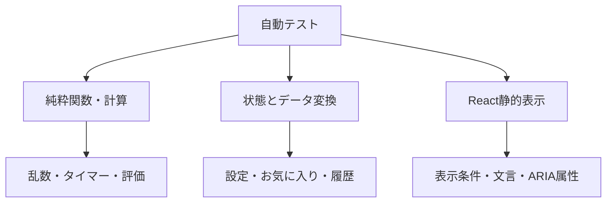
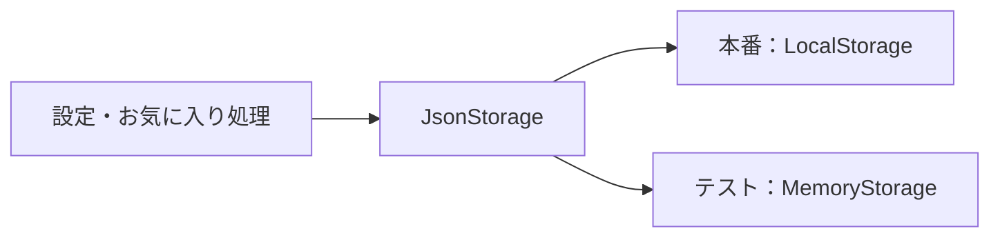

# テスト方針

このドキュメントでは、「立体ドローイング」のテスト方針、対象範囲、実行方法、テストデータの扱い、手動確認項目を説明します。

## 1. テストの目的

このプロジェクトでは、次の状態を維持するためにテストを行います。

- 同じ設定とシードから同じ見本を再現できる
- タイマーや練習回数が境界値でも正しく動く
- 設定やお気に入りの保存データが壊れていてもアプリを継続できる
- 描画ツールを追加・変更しても既存ツールの動作を壊さない
- 自動形状評価の基準を意図せず変更しない
- 画面モードごとに必要な情報と操作が表示される
- GitHub Pagesへ公開できる静的ファイルを生成できる

見た目の細かな実装より、ユーザー操作へ直接影響する計算、状態遷移、データ変換を優先してテストします。

## 2. 現在のテスト構成

テストランナーにはVitestを使用しています。

```text
Vitest
├─ 実行環境：Node.js
├─ 対象：src/**/*.test.ts
└─ 設定：vitest.config.ts
```

現在のテストは、大きく次の3種類に分かれます。



### 純粋関数・計算のテスト

入力と出力だけで確認できるロジックを直接テストします。

- シード付き乱数
- 出題生成
- タイマー計算
- 描画履歴
- SVG生成
- 画像配置と保存ファイル名
- 自動形状評価
- Three.js用ジオメトリ生成

### 状態とデータ変換のテスト

ブラウザやReactへ強く依存しない形に分離した状態処理をテストします。

- 設定の更新と正規化
- 練習セッションの準備
- お気に入りの保存と復元
- LocalStorage共通処理
- 描画ツールの登録

### React静的表示のテスト

画面コンポーネントを`renderToStaticMarkup`でHTML文字列へ変換し、必要な内容が表示されるか確認します。

- トップ画面
- 設定画面
- 練習画面
- 結果画面
- お気に入り画面

この方法では、条件による表示の切り替え、ボタンやCanvasの有無、ARIA属性などを高速に確認できます。一方、クリックやペン入力などの実際のブラウザ操作は対象外です。

## 3. テスト対象一覧

| 分類 | 対象 | 主な確認内容 |
| --- | --- | --- |
| 乱数 | `domain/random` | 同じシードから同じ数列を生成、32ビット範囲への正規化 |
| 出題 | `domain/prompt` | 再現性、値の範囲、連続した同一形状の回避、生成情報の保存 |
| 設定 | `features/settings` | 保存と復元、不正値の補正、選択肢の更新 |
| 練習 | `features/practice` | 設定検証、出題準備、再挑戦、タイマー |
| 描画 | `features/drawing` | 履歴、ツール登録、SVG生成、消しゴムマスク |
| 見本 | `features/sample` | 6種類の形状生成、三角錐の面構成、輪郭補強対象 |
| 評価 | `features/evaluation` | 中心合わせ、輪郭、傾き、大きさ、比率、総合点 |
| 結果 | `features/results` | 比較モード、評価表示、保存画像の配置と名前 |
| お気に入り | `features/favorites` | 保存、復元、不正データ、保存件数上限 |
| 共通保存 | `shared/storage` | JSON変換、破損データ、利用できない保存先 |
| 画面 | 各`*-screen` | 表示条件、主要操作、アクセシビリティ属性 |

## 4. 実行方法

### すべてのテスト

```bash
npm test
```

### 特定のテストファイル

```bash
npm test -- src/features/evaluation/mask-evaluator.test.ts
```

### ファイル名の一部で絞り込む

```bash
npm test -- timer
```

現在の`npm test`は、一度実行して終了する形式です。監視モードはpackage.jsonのスクリプトとしては定義していません。

## 5. 変更後の基本確認

コードを変更した後は、次の4項目を基本的な確認とします。

```bash
npm test
npm run typecheck
npm run lint
npm run build:pages
```

| コマンド | 確認内容 |
| --- | --- |
| `npm test` | 計算、状態、表示ロジックの回帰 |
| `npm run typecheck` | TypeScriptの型整合性 |
| `npm run lint` | コード品質と構文上の問題 |
| `npm run build:pages` | GitHub Pages用の静的ビルド |

READMEや`docs/`だけを変更した場合は、Markdownの表示とリンクを確認し、アプリケーションコードへ影響しないことを確認します。

## 6. 再現可能なテストデータ

### 固定シード

出題生成のテストでは固定シードを使用します。同じシードと設定から、形状、比率、カメラ、立体の回転、光源が同じ順番で生成されることを確認します。

```text
同じシード + 同じ設定 + 同じ生成バージョン
= 同じShapePrompt配列
```

出題生成内で`Math.random()`を直接使用していないこともテストします。これにより、失敗時の出題条件を再現できます。

### 固定時刻

保存ファイル名や日時表示のテストでは、テストコードから決まった`Date`を渡します。実行時刻によってテスト結果が変化しないようにします。

### 数値で渡す時刻

タイマーは、`performance.now()`そのものを直接テストするのではなく、開始時刻、現在時刻、残り時間を純粋関数へ数値として渡して確認します。

これにより次を再現できます。

- 1秒未満では表示秒数が変わらない
- 0秒で一度だけ完了する
- 残り時間が負にならない
- 一時停止後の経過時間を継続する
- 時間切れ時は設定した秒数を正確に記録する

### 人工的な評価マスク

自動形状評価では、矩形や折れ線などの二値マスクをテスト内で生成します。実際のThree.js描画やCanvasのアンチエイリアスへ依存せず、評価式の挙動だけを確認できます。

## 7. ブラウザ機能の差し替え

### LocalStorage

設定とお気に入りの保存関数は、ブラウザのLocalStorageを直接固定せず、同じインターフェースを持つ保存先を引数として受け取れます。

テストでは、`Map`を使ったメモリ上の保存先へ差し替えます。



この構成により、次のケースをブラウザなしで確認できます。

- 正常な保存と復元
- 壊れたJSON
- 古い形式の設定
- 範囲外の値
- 保存先が利用できない場合
- 書き込み時に例外が発生する場合

### CanvasとThree.js

Node環境では実際のブラウザCanvasやWebGLを描画しません。Canvasへ渡す前後のデータや、Three.jsのジオメトリ生成を分離してテストします。

実際の見本の見え方、Canvasのリサイズ、ペン入力は手動確認の対象です。

## 8. 画面コンポーネントのテスト方針

画面テストでは、イベント処理を空の関数へ差し替え、propsによる表示結果を確認します。

主に次を検証します。

- 見出しや説明が表示される
- 設定に応じて必要な操作が表示される
- 利用できない操作が表示されない、または無効になる
- タイマーと進捗の値が表示される
- 一時停止、見本非表示、見本のみ表示を区別できる
- 横並びと重ね合わせの結果を切り替えられる構造になっている
- ラベル、`aria-live`、`aria-pressed`などが出力される

静的HTMLテストは、操作後のstate更新やブラウザ固有のイベントを確認するものではありません。

## 9. 自動形状評価のテスト方針

評価ロジックは変更によって得点が変わりやすいため、意図を示す具体的なケースを用意します。

| ケース | 期待結果 |
| --- | --- |
| 見本と同じ形・同じ位置 | 全項目100点 |
| 見本と同じ形・異なる位置 | 中心合わせ後も100点 |
| 同じ比率で大きさが異なる | 大きさだけが下がる |
| 幅と高さの比率が異なる | 比率が下がる |
| 外接矩形は同じで線の傾きが異なる | 傾きが下がる |
| 描画ピクセルが不足 | 評価0点 |

総合点については、次の重みと一致することをテストします。

```text
輪郭45％ + 傾き25％ + 大きさ20％ + 比率10％
```

評価仕様の詳細は[EVALUATION.md](./EVALUATION.md)を参照してください。

## 10. 描画ツールのテスト方針

各ツールはツールレジストリを経由して利用します。新しいツールを追加するときは、少なくとも次を確認します。

- IDがほかのツールと重複しない
- 正しいツールIDでストロークを生成する
- 線幅と透明度が定義どおりになる
- 点線パターンが定義どおりになる
- カーソルサイズが描画サイズと対応する
- 評価時に`draw`、`erase`、`ignore`のどれとして扱うか
- SVG出力でも同じ意味を保つ

消しゴムについては、後から描いた消しゴムが、それ以前の線だけへ適用されるSVGマスクを生成することを確認します。

## 11. 手動確認

現在は実ブラウザのE2Eテストと画像差分テストを導入していないため、次の項目は手動で確認します。

### 基本シナリオ

1. デフォルト設定で練習を開始できる
2. 制限時間終了時に自動で次へ進む
3. 一時停止と再開ができる
4. ペン、点線、補助線、消しゴムで描画できる
5. 元に戻す、やり直す、全消去が動作する
6. 最終問題の後に結果画面へ移動する
7. 横並びと重ね合わせを切り替えられる
8. 見本、描画、比較、全結果を保存できる
9. お気に入りへ追加し、同じ見本で再練習できる
10. 再読み込み後も設定とお気に入りが残る

### 表示設定

- 6種類すべての立体が表示される
- 簡単・難しいで立体の向きが変わる
- 3種類の見本表示が切り替わる
- 光源方向の表示と見本が対応する
- 見本を途中で隠すモードが動作する
- 見本のみ表示モードでは描画操作と評価が表示されない
- 見本と描画スペースの上下左右配置が切り替わる

### 画面サイズ

最低限、次の条件を確認します。

| 条件 | 確認内容 |
| --- | --- |
| 一般的なデスクトップ | TOP、設定、練習、比較の全体配置 |
| 横長画面 | 見本と描画スペース、操作ボタンが一画面内に収まる |
| `1280 × 551` | 液晶ペンタブレット向け配置とタッチ可能な操作領域 |
| 全画面表示 | 不要な縦スクロールが発生しない |
| 縦幅だけを変更 | 見本と描画、比較画像が同じ割合で伸縮する |
| 狭い画面 | 画面が一列へ切り替わり、横スクロールが発生しない |

### 入力方法

- マウス
- タッチ
- ペン入力
- キーボードによるフォーカス移動

## 12. 不具合を修正するときのテスト

不具合を修正するときは、可能であれば次の順番で進めます。

1. 不具合を再現する最小条件を特定する
2. 固定シード、固定時刻、固定データへ置き換える
3. 修正前に失敗するテストを追加する
4. 必要な範囲だけを修正する
5. 追加したテストと全テストを実行する
6. 型チェック、Lint、GitHub Pages用ビルドを実行する
7. ブラウザ固有の問題は対象サイズと入力方法で手動確認する

CSSだけの不具合など、自動テストで再現しにくい場合は、発生した画面サイズと表示条件を記録します。

## 13. 新しいテストの書き方

### 配置

テストファイルは、対象ファイルと同じ機能ディレクトリへ配置します。

```text
feature.ts
feature.test.ts
```

### 基本方針

- 1つのテストでは1つの意図を明確にする
- 実行順序へ依存させない
- 現在時刻やランダム値を固定する
- 内部実装ではなく外から確認できる結果を優先する
- 正常系だけでなく境界値と不正データを含める
- 期待値から、なぜその仕様なのか読み取れるようにする

### 構成例

```ts
it('同じシードから同じ出題を生成する', () => {
  // Arrange: 固定した設定とシードを準備する
  // Act: 同じ条件で2回生成する
  // Assert: 生成結果全体が一致する
});
```

コメントは必須ではありませんが、準備・実行・確認が複雑な場合は意図が分かる形に分けます。

## 14. CIと公開時の確認

GitHub Actionsには、品質確認とGitHub Pages公開の2つのワークフローがあります。

### 品質確認

`ci.yml`は、`main`ブランチへのpush、Pull Request、手動実行を契機に次を実行します。

1. Node.js 22.13.0を準備する
2. `npm ci`で依存パッケージをインストールする
3. `npm test`を実行する
4. `npm run typecheck`を実行する
5. `npm run lint`を実行する
6. `npm run build:pages`を実行する

### GitHub Pages公開

`pages.yml`は、`main`ブランチへのpushまたは手動実行を契機に次を実行します。

1. Node.js 22.13.0を準備する
2. `npm ci`で依存パッケージをインストールする
3. `npm run build:pages`を実行する
4. `pages-dist`をGitHub Pagesへ公開する

現在、この2つは独立したワークフローです。品質確認が失敗しても、Pages公開ワークフローを自動的に停止する構成にはなっていません。そのため、push前にもローカルで基本確認を完了させます。

## 15. 現在未導入のテスト

### E2Eテスト

実ブラウザ上で、設定、描画、時間切れ、比較、保存、お気に入りまでを通した操作テストは未導入です。

### Canvas・WebGLの描画結果テスト

Three.jsで生成した見本やCanvasの線を、画像差分で比較するテストは未導入です。

### レスポンシブの自動テスト

複数の画面サイズでスクロール量、ボタン位置、Canvas寸法を自動確認するテストは未導入です。

### アクセシビリティ自動検査

静的HTML内のARIA属性は確認していますが、専用ツールによるアクセシビリティ検査は未導入です。

### カバレッジ計測

コードカバレッジの目標値や自動計測は設定していません。単純な数値を増やすことより、重要な仕様と過去に発生した不具合をテストへ残すことを優先しています。

## 16. 今後の改善候補

優先度の高い順に、次を候補とします。

1. 品質確認が成功した場合だけ公開するようワークフローを統合する
2. Playwrightなどを使った主要操作のE2Eテストを追加する
3. `1280 × 551`を含むレスポンシブ確認を自動化する
4. CanvasとThree.jsの代表的な画像差分テストを追加する
5. キーボード操作とアクセシビリティの自動検査を追加する
6. 自動評価の回帰データを増やす

自動化が難しい項目は、手動確認の条件と結果を記録し、再現可能性を保つことを優先します。
